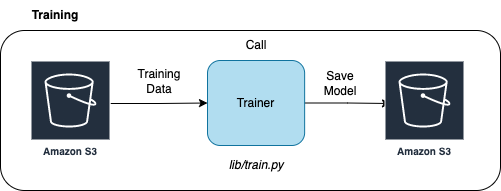
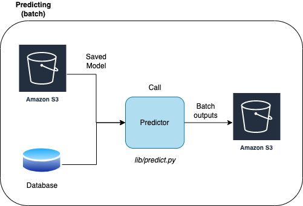
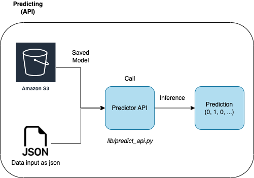

# Model Deployment

**Author**: Patrick Spencer  

## Overview

Productionizes a machine learning model with Docker and IaaS.

### Diagrams





## Commands

### Docker commands

Run these commands in the base directory with README.md.

Build Docker Image:
```bash
sh scripts/docker_build.sh
```

Run docker image
```
sh scripts/docker_run.sh
```

### Train and Predict bash files

These bash files are a quick way to load the python files

Run training bash file
```bash
sh scripts/train.sh
```

Run predictor bash file
```bash
sh scripts/predict.sh
```

### Train and predict python files

Run training python file
```python3
python3 lib/train.py configs/train_config.json
```

Run predictor bash file
```python
python3 lib/predict.py configs/predict_config.json
```

## Predictor API

Predictor API is built with Flask. run this script to start the server
```bash
sh scripts/start_predictor_api.sh
```

Test api calls with this file
```bash
sh scripts/api_test.sh
sh scripts/api_test_large.sh
```

## Open AWS Bucket

[model-deployment-example-ps-v1](https://s3.console.aws.amazon.com/s3/buckets/model-deployment-example-ps-v1?region=us-west-2&tab=objects)

## Details

Package version are reference in `requirements.txt` file. The version numbers
for sklearn and pandas depend on the docker image version. Don't change these
unless you change the Docker image.

## Python version

This works for Python 3.10.8. This is the version on the base Docker image.